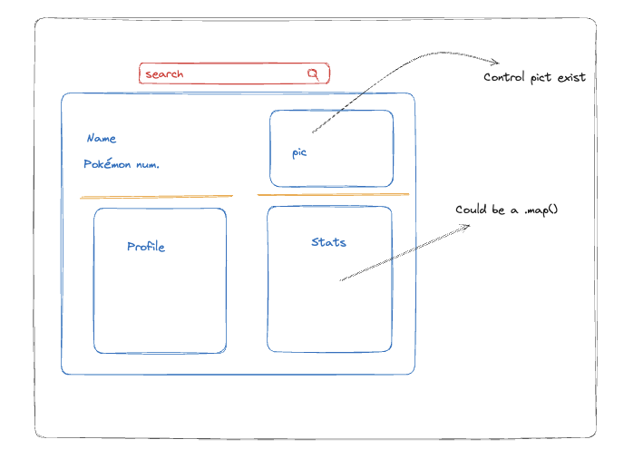

# Pokemon-app 🐉🐉

Welcome to the Pokémon-app! This application allows users to search for Pokémon using the external PokeAPI. Users can simply enter the name of a Pokémon, and through a user-friendly interface, various data about the Pokémon will be displayed.

## Viewport recomendation 🖥️
-   This app is web first.
## Features 📦

- **User Input**: Users can input the name of the Pokémon they want to search for.
- **Data Display**: The app will display the following information about the Pokémon:
  - Pokémon ID
  - Image
  - Height
  - Weight
  - Abilities
  - Type of the Pokémon
  - Attributes such as Attack, Defense, and more.

## Technologies Used 💻

- React
- TypeScript
- Tailwind CSS
- Postman (for API exploration)
- Axios (for making API requests)
- Fontawesome
- Jest

##### <em>Initial schematic representation of the app (pre-development):</em>

## How to Start 🏃‍♂️

To run this application locally, follow these steps:

1. Clone this repository.
2. Navigate to the project directory: `cd pokemon-app`.
3. Install the required dependencies: `npm install`.
4. Start the development server: `npm start`.
5. Open your web browser and go to `http://localhost:3000` to view the app.

To test this application, use the script `npm run test`
- Note that you have another test script `npm run test-coverage` with global coverage of the app.

## Usage 🔍

1. When you open the app, you will see an input field where you can enter the name of the Pokémon you want to search for.
2. After entering the Pokémon name, press the "Search" button.
3. The app will display the retrieved data about the Pokémon, including its ID, image, height, weight, abilities, types, and attributes.

## Notes 📝

- I chose to use this approach because for the moment there will just be one view available for the user to navigate to, therefore only one url to use. Whenever the app will display more than one view, I will set specific paths for each view (like "/profile", "/about", etc), and in that scenario, the path = "*" would serve as a safeguard against incorrect urls, and it would display a 404 view to the user.
- I decided to create a folder "utils" to contain some methods that even though in the present they are just used by one component (PokemonCard) they contain logic that in the future could be used from multiple components (for example, the ``conversionHeight`` method).

## Improvements that could be made to the app 🚀
- Adding a dynamic search feature that suggests matches as a name is entered into the search bar.
- Enhancing the user experience by improving the interface to include a "Pokémon Not Found" component style, or by adding a Home component from which the user can navigate to the app's views.
- If the app were to have more than one type of request to the API, it would generate a "Services" folder with classes and methods for each call.
- Add more unit testing to achieve a higher coverage.

It has really been a happy coding time! 💻

